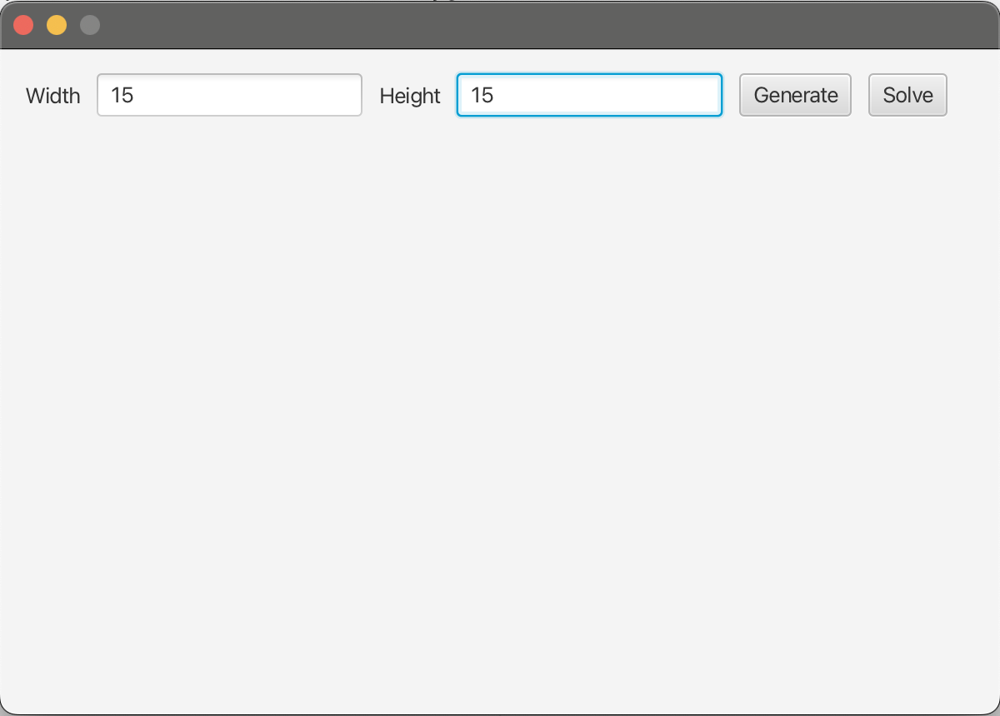

It is a personal project that I developed with my own will (without using Chatgpt) because I have not been dealing with java for a long time. The aim here is to try to find the shortest path in a maze using Q-Learning ([click](https://en.wikipedia.org/wiki/Q-learning) for detailed information). 

In the written code, coding principles such as SOLID, KISS were not paid attention and the algorithm was completely focused on the algorithm. 

There may also be deficiencies in the OOP parts because the code quality is not thought about much. I aim to go back as soon as possible and improve the code quality.

The application asks you for the dimensions of the labyrinth on the opening screen.

For example, let's draw a 15 by 15 labyrinth. (Width and height values cannot be higher or lower than the values in the config file.)

The algorithm quickly checks the maze in the background to see if the maze does not have a way out. If there is no way out, it creates a new maze in the background.

When you click on the ‘Solve’ button, it shows you the shortest path on the maze by numbering it.
